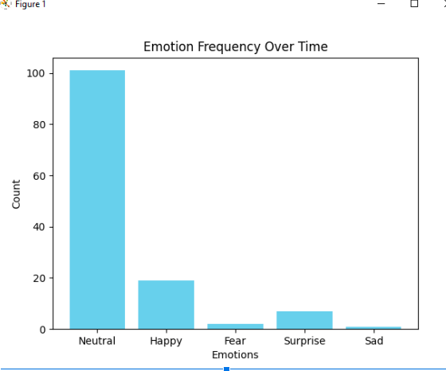
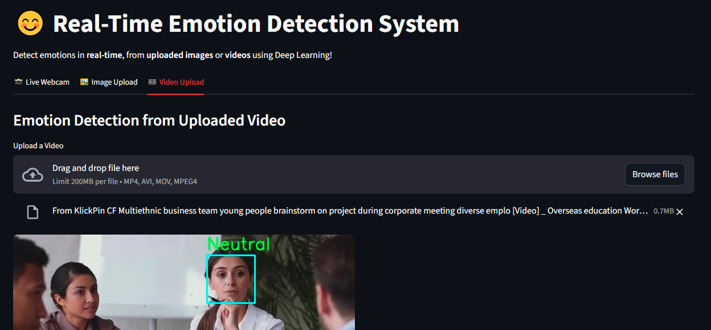
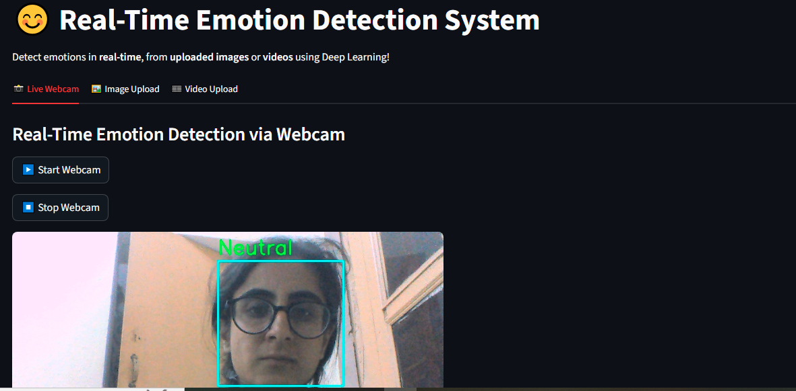

#  Real-Time Emotion Detection System

This project detects human emotions in real-time using deep learning and computer vision.  
It captures live video from a webcam, processes facial expressions, and classifies them into emotions such as **Happy**, **Sad**, **Angry**, **Surprised**, **Neutral**, etc.

---

##  Project Overview
This project was developed as part of a Machine Learning task focusing on **real-time emotion recognition**.  
It includes data preprocessing, model training, and real-time detection using OpenCV.

---

##  Features
 * Face detection using Haar Cascade  
 * Emotion classification using a trained CNN model  
 * Real-time webcam detection  
 * Emotion analytics dashboard (optional)  
 * Grayscale and color support for better visibility  
 * Optimized performance with reduced latency  

---

##  Model Training
The model was trained using a labeled emotion dataset (such as FER2013).  
It includes the following steps:
1. Data Preprocessing  
2. Normalization and Augmentation  
3. Model Training (CNN-based)  
4. Evaluation and Accuracy Testing  

---

##  Real-Time Detection
The webcam captures live frames, detects faces, and predicts emotions instantly.  
The emotion label appears above each detected face.

---

##  Optional Enhancements
- Emotion analytics dashboard showing live emotion distribution  
- Logging detected emotions for trend analysis  
- Voice feedback or alerts based on detected emotion  

---

##  Tech Stack
- **Language:** Python  
- **Libraries:** OpenCV, TensorFlow, Keras, NumPy, Matplotlib, Pandas  
- **Frameworks:** Streamlit (for app) 

---

##  Sample Output
   
Example:  

- Screenshot of real-time webcam detection window  
- Screenshot of analytics dashboard  

---

